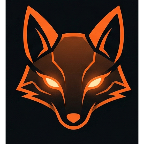

  
  <h1>🎌 Nexime | Showcase Website</h1>
  
<em>The cinematic landing experience for the Nexime mobile application.</em>

  

    
    
    
  

---

The official showcase website for **[Nexime](https://nexime.vercel.app)**. 

We wanted the website to feel just as premium as the app itself. Instead of a basic template, this is a custom-built, OLED-optimized digital storefront. It combines cinematic dark mode, frosted glass UI, and buttery smooth CSS animations, all while using Astro's architecture to keep load times lightning-fast.

## ✨ Architectural Highlights

* 🚀 **Zero-JS by Default:** Built with Astro to ship zero client-side JavaScript for UI rendering, resulting in instant load times and perfect SEO.
* 🌗 **Cinematic Dark Mode Native:** Designed exclusively for OLED and high-contrast displays, utilizing deep blacks, ambient mesh gradients, and precise frosted glassmorphism.
* 📱 **Pure CSS Device Mockups:** Device bezels and hardware notches are drawn using pure Tailwind CSS and arbitrary aspect-ratio scaling, avoiding heavy `.png` mockup frames and preventing image distortion.
* 🎬 **Hardware-Accelerated Animations:** Features continuous, seamless Marquee scrolling, slot-machine text flipping, and scroll-triggered intersection observers optimized for 60fps rendering without jank.
* 🍱 **Responsive Bento Grids:** Complex, asymmetrical CSS Grid layouts that fluidly adapt from panoramic desktop views to stacked mobile cards without breaking layout integrity.

## 🛠️ The Tech Stack

* **Framework:** [Astro](https://astro.build/)
* **Styling:** Tailwind CSS
* **Icons & Assets:** Optimized natively via `astro:assets` `<Image />` component